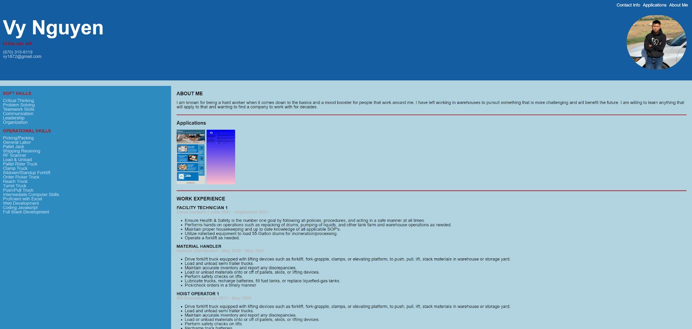

# portfolio
## DESCRIPTION
This is the portfolio I have made just using HTML and CSS together. I have kept it really simple so it looks pleasing to the eye. The navigation bar will follow the user wherever he or she scrolls. In addition to that clicking on the text on the top right hand corner will take the user to the specific section of the page. The contents of this page includes six section and they are named soft skills, operational skills, about me, applications, work experience, and education.

## Table of Contents
* [Preview](#Preview)
* [Link](#Link)
* [License](#License)
* [Contributing](#Contributing)
* [Questions](#Questions)

## Preview

## Link
[Vy's Portfolio](https://vy187.github.io/portfolio/)

## License

Copyright (c) [2022] [Vy Nguyen]

Permission is hereby granted, free of charge, to any person obtaining a copy of this software and associated documentation files (the "Software"), to deal in the Software without restriction, including without limitation the rights to use, copy, modify, merge, publish, distribute, sublicense, and/or sell copies of the Software, and to permit persons to whom the Software is furnished to do so, subject to the following conditions:

The above copyright notice and this permission notice shall be included in all copies or substantial portions of the Software.

THE SOFTWARE IS PROVIDED "AS IS", WITHOUT WARRANTY OF ANY KIND, EXPRESS OR IMPLIED, INCLUDING BUT NOT LIMITED TO THE WARRANTIES OF MERCHANTABILITY, FITNESS FOR A PARTICULAR PURPOSE AND NONINFRINGEMENT. IN NO EVENT SHALL THE AUTHORS OR COPYRIGHT HOLDERS BE LIABLE FOR ANY CLAIM, DAMAGES OR OTHER LIABILITY, WHETHER IN AN ACTION OF CONTRACT, TORT OR OTHERWISE, ARISING FROM, OUT OF OR IN CONNECTION WITH THE SOFTWARE OR THE USE OR OTHER DEALINGS IN THE SOFTWARE.

For more information, please visit: https://opensource.org/licenses/MIT

## Contributing
[Vy Nguyen](https://github.com/Vy187)

## Questions
If you have any questions about the repo, open an inssue or contact us directly at vy1872@gmail.com